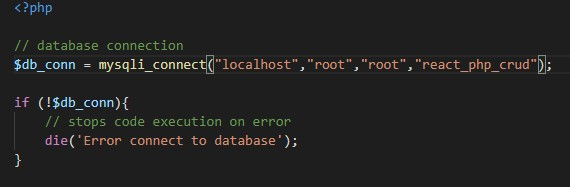
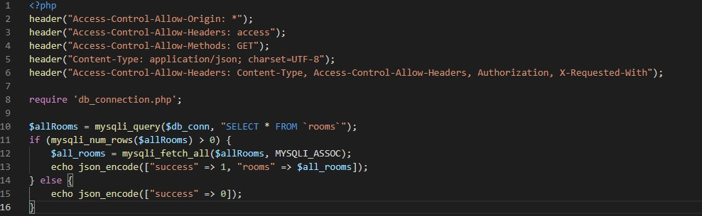
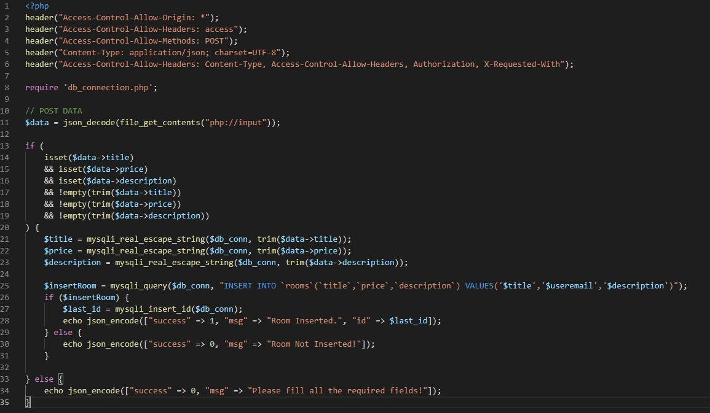
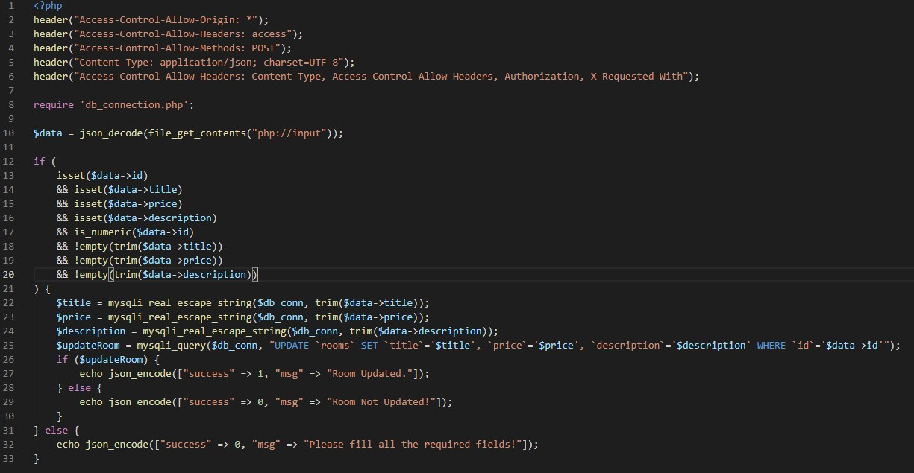
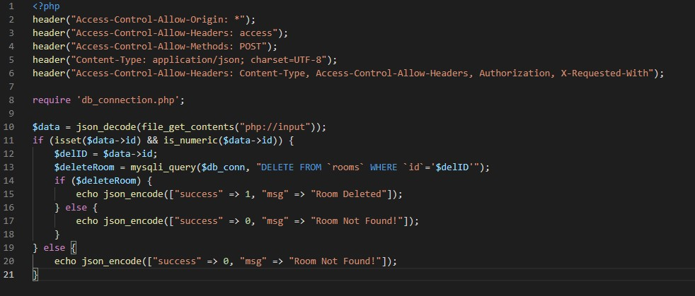

# Mini application for booking rooms
---
/Footer, InsertForm, Table and SearchForm")

---

## Stack of technology:

* react
* php
* mySQL
* CRUD
* web API 
* Libraries: bootstrap, materialize

---

## SQL

Database name – react_php_crud
log/pas: root
Table name – rooms

---

SQL code to create the rooms table and the structure of the rooms table:
CREATE TABLE `react_php_crud`.`rooms` ( `id` INT(11) NOT NULL AUTO_INCREMENT , `title` VARCHAR(255) NULL DEFAULT NULL , `price` BIGINT(11) NULL DEFAULT NULL , `description` TEXT NULL DEFAULT NULL , PRIMARY KEY (`id`)) ENGINE = InnoDB;

---

INSERT INTO `rooms` (`id`, `title`, `price`, `description`) VALUES (NULL, 'Single room', '100', 'these rooms are assigned to one person or a couple. It may have one or more beds, but the size of the bed depends on the hotel. Some single rooms have a twin bed, most will have a double, few will have a queen bed.');
INSERT INTO `rooms` (`id`, `title`, `price`, `description`) VALUES (NULL, 'Double room', '200', 'double rooms are assigned to two people; expect one double bed, or two twin beds depending on the hotel.');
INSERT INTO `rooms` (`id`, `title`, `price`, `description`) VALUES (NULL, 'Triple room', '300', 'as the name might suggest, this room is equipped for three people to stay. The room will have a combination of either three twin beds, one double bed and a twin, or two double beds.');
INSERT INTO `rooms` (`id`, `title`, `price`, `description`) VALUES (NULL, 'Quad room', '400', 'a quad room is set up for four people to stay comfortably. This means the room will have two double beds. Some, however, may be set up dormitory-style with bunks or twins, so check with the property to make sure.');
INSERT INTO `rooms` (`id`, `title`, `price`, `description`) VALUES (NULL, 'Double-double', '500', 'these rooms have two double beds (sometimes two queen beds) and are meant to accommodate two to four people, especially families traveling with young kids.');
INSERT INTO `rooms` (`id`, `title`, `price`, `description`) VALUES (NULL, 'Queen', '600', 'A room with a queen-sized bed. May be occupied by one or more people.');

---

## PHP

### db_connection.php
---

---

### all-rooms.php
---

---
### add-room.php
---

---

### update-room.php
---

---

### delete-room.php
---

---

## Options
---
### Insert and Edit information to DataBase

---
### Search room

---
### More information - details of the room and Button: 'Book a room'

---

## Available Scripts
In the project directory, you can run:

### `npm start`

Runs the app in the development mode.\
Open [http://localhost:3000](http://localhost:3000) to view it in your browser.

The page will reload when you make changes.\
You may also see any lint errors in the console.

### `npm test`

Launches the test runner in the interactive watch mode.\
See the section about [running tests](https://facebook.github.io/create-react-app/docs/running-tests) for more information.

### `npm run build`

Builds the app for production to the `build` folder.\
It correctly bundles React in production mode and optimizes the build for the best performance.

The build is minified and the filenames include the hashes.\
Your app is ready to be deployed!

See the section about [deployment](https://facebook.github.io/create-react-app/docs/deployment) for more information.

### `npm run eject`

**Note: this is a one-way operation. Once you `eject`, you can't go back!**

If you aren't satisfied with the build tool and configuration choices, you can `eject` at any time. This command will remove the single build dependency from your project.

Instead, it will copy all the configuration files and the transitive dependencies (webpack, Babel, ESLint, etc) right into your project so you have full control over them. All of the commands except `eject` will still work, but they will point to the copied scripts so you can tweak them. At this point you're on your own.

You don't have to ever use `eject`. The curated feature set is suitable for small and middle deployments, and you shouldn't feel obligated to use this feature. However we understand that this tool wouldn't be useful if you couldn't customize it when you are ready for it.

## Learn More

You can learn more in the [Create React App documentation](https://facebook.github.io/create-react-app/docs/getting-started).

To learn React, check out the [React documentation](https://reactjs.org/).

### Code Splitting

This section has moved here: [https://facebook.github.io/create-react-app/docs/code-splitting](https://facebook.github.io/create-react-app/docs/code-splitting)

### Analyzing the Bundle Size

This section has moved here: [https://facebook.github.io/create-react-app/docs/analyzing-the-bundle-size](https://facebook.github.io/create-react-app/docs/analyzing-the-bundle-size)

### Making a Progressive Web App

This section has moved here: [https://facebook.github.io/create-react-app/docs/making-a-progressive-web-app](https://facebook.github.io/create-react-app/docs/making-a-progressive-web-app)

### Advanced Configuration

This section has moved here: [https://facebook.github.io/create-react-app/docs/advanced-configuration](https://facebook.github.io/create-react-app/docs/advanced-configuration)

### Deployment

This section has moved here: [https://facebook.github.io/create-react-app/docs/deployment](https://facebook.github.io/create-react-app/docs/deployment)

### `npm run build` fails to minify

This section has moved here: [https://facebook.github.io/create-react-app/docs/troubleshooting#npm-run-build-fails-to-minify](https://facebook.github.io/create-react-app/docs/troubleshooting#npm-run-build-fails-to-minify)
